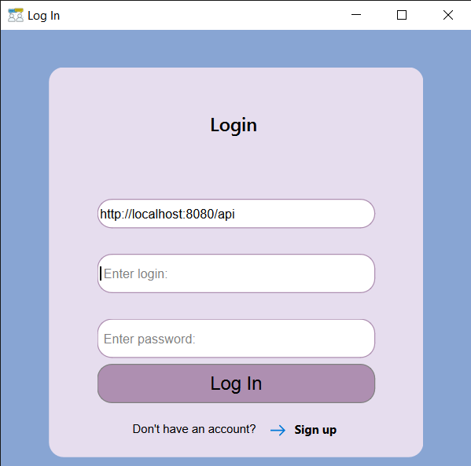
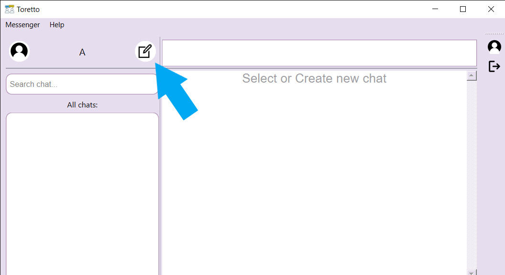
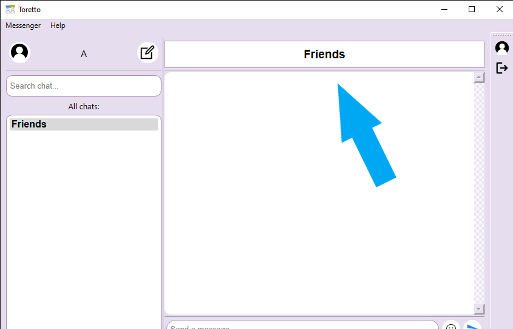
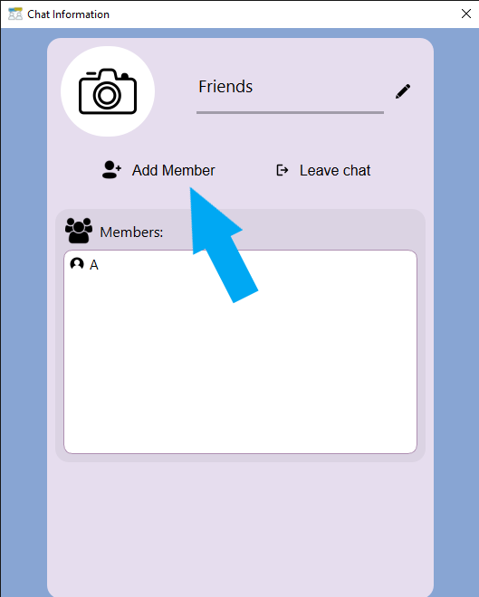

# HTTP_Messenger_Client


## Installation

### Download installer

```shell
curl -L -o HTTP_Messenger_installer.zip https://github.com/ita-social-projects/HTTP_Messenger_Client/releases/tag/release/HTTP_Messenger_installer.zip
```

#### Or install manually <a href="https://github.com/ita-social-projects/HTTP_Messenger_Client/releases/tag/release"> here </a>

### Run installer

---

# How to use HTTP_Messenger

## This window will appear after you open it for the first time:



### At first enter the URL address of HTTP_Messenger_Server (by default it refers to localhost). 
### After that enter your login and password to get into your account.

### If you don't have account😳 in our cool and innovative Messenger💪, 
### you can create one by clicking "Sign up" button at the bottom of login window.


### Once you are in, you can chat with your friends  (if you have them😁) or colleagues, but they also need to register in HTTP_Messenger

## To create chat click this button:



### After that you will have to enter the name of your new chat, and click "Create" 

## To add friends to your chat ckick on your chat title:



### Then in Chat info window click on "Add member" 



### And search for your friends

Can`t find them? Maybe they don't want to chat with you(

# That's it!😎 Now you can switch to really fast and secure HTTP_Messenger💪!!

---

## Contributing

### **Attention: QStateMachine is required for this project!!!**

#### Step 1

- **Option 1**
    - 🍴 Fork this repo!

- **Option 2**
    - 👯 Clone this repo to your local machine using `https://github.com/ita-social-projects/HTTP_Messenger_Client.git`

#### Step 2

- **HACK AWAY!** 🔨🔨🔨

#### Step 3

- 🔃 Create a new pull request using <a href="https://github.com/ita-social-projects/HTTP_Messenger_Client/compare/" target="_blank">github.com/ita-social-projects/HTTP_Messenger_Client</a>.

---
## Issue flow

No isses 🙂

---

## Our team

[](https://github.com/RomanKasko)
[](https://github.com/BeliaViktoria)
[](https://github.com/Morituri67)
[](https://github.com/AndrianKupyniak)
[](https://github.com/Yurazast)
[](https://github.com/PaulMoroz)
[](https://github.com/losimen)
[](https://github.com/Vitalik-Kshly)

---

## License

[](http://badges.mit-license.org)

- **[MIT license](http://opensource.org/licenses/mit-license.php)**
- Copyright 2020 © <a href="https://softserve.academy/" target="_blank"> SoftServe IT Academy</a>.